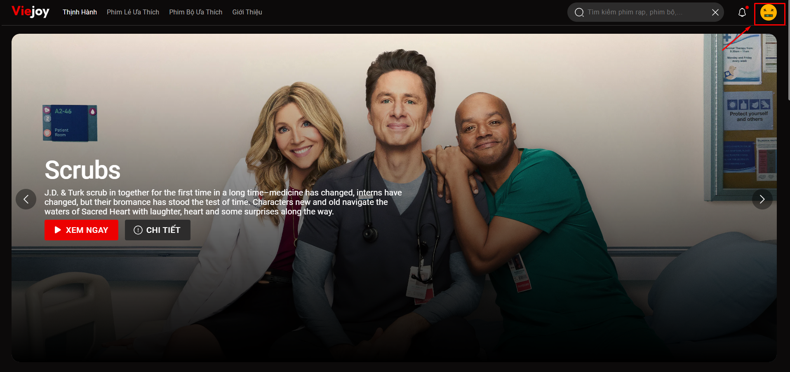
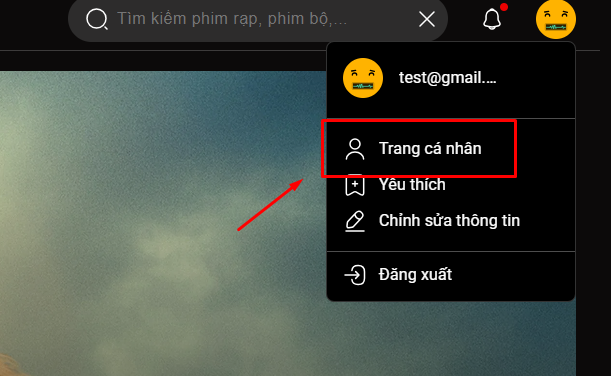
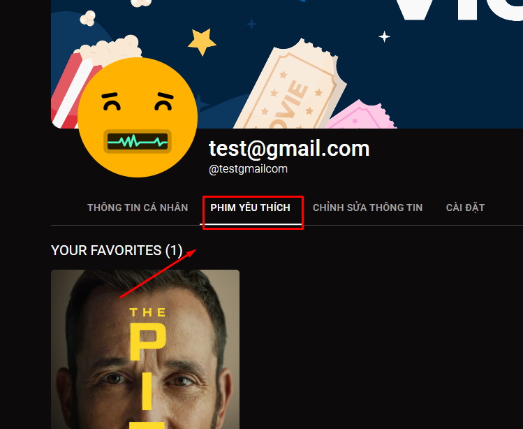
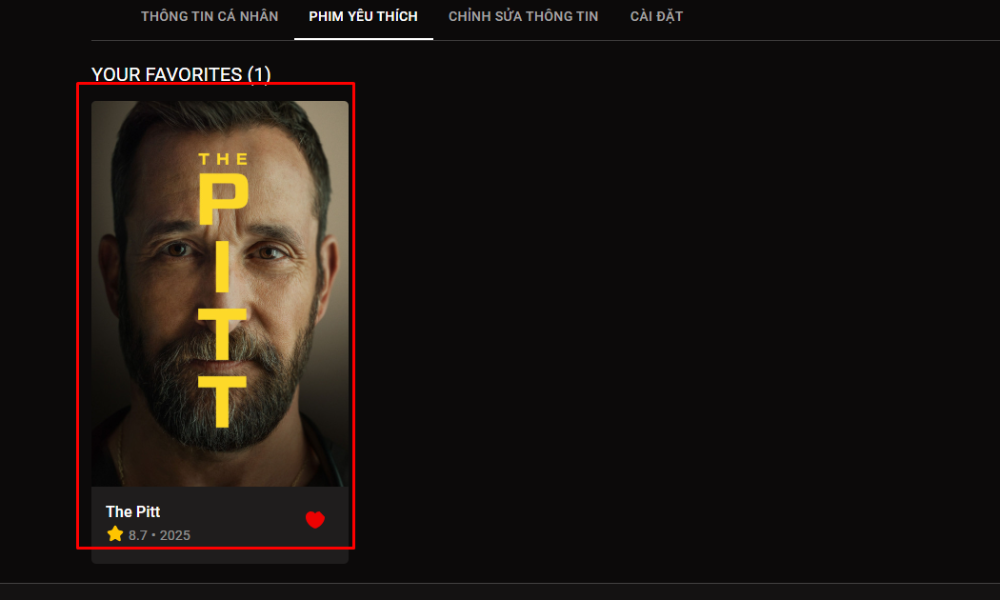
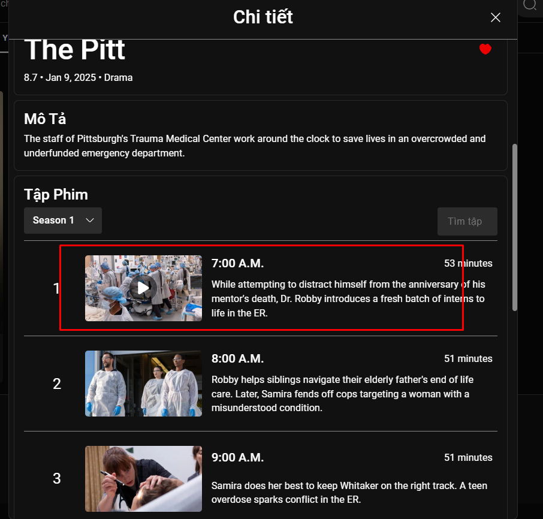
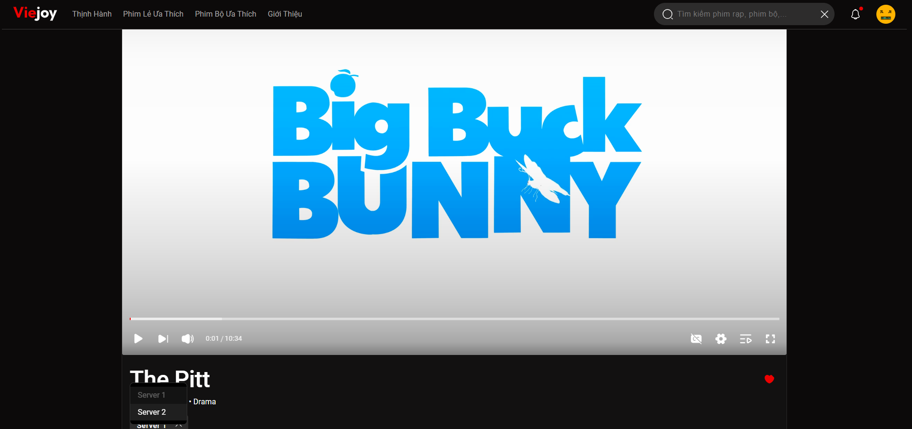

# Hướng dẫn test chức năng xem video trên Vidstack Player

## 1. Đăng nhập hệ thống

Sử dụng tài khoản test để truy cập:

- **Email:** [test@gmail.com](mailto:test@gmail.com)
- **Mật khẩu:** testUser123@

---

## 2. Truy cập trang người dùng

Sau khi đăng nhập thành công:

- Nhấn vào biểu tượng người dùng trên thanh điều hướng.
- Chọn mục **Trang cá nhân**.

(Hình minh họa bên dưới)

---

## 3. Truy cập mục “Phim Yêu Thích”

- Trong trang cá nhân, chọn tab **Phim Yêu Thích** để xem danh sách phim đã lưu.

---

## 4. Chọn phim

- Nhấn vào **poster phim** để chuyển đến chi tiết phim.

---

## 5. Chọn tập phim

- Trong trang chi tiết, chọn tập phim muốn xem.

---

## 6. Kiểm tra trang xem phim

- Hệ thống sẽ chuyển đến trang phát video.
- Xác nhận video được tải và phát bình thường trên **Vidstack Player**.

